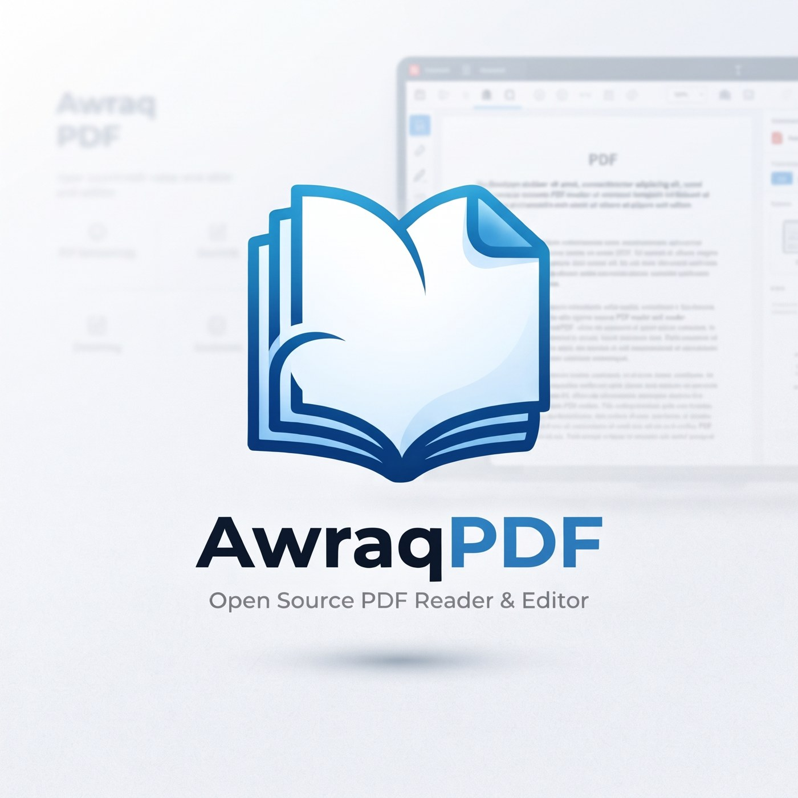

<p align="center"></p>

<h1 align="center">Awraq PDF · أوراق PDF</h1>
<p align="center"><b>Open Source PDF Reader &amp; Editor</b> — قارئ ومحرر PDF مجاني ومفتوح المصدر لويندوز</p>
<p align="center">
  <a href="https://github.com/SoCalledBlackBurn/awraq-pdf/releases/latest"></a>
  <a href="LICENSE"></a>
  
</p>
<p align="center">العربية · English · Français · Español · Türkçe</p>

## المميزات · Features

- **Reading:** tabs (drag to reorder, tear off into new windows), thumbnails, outline, bookmarks, attachments, continuous / single / horizontal / grid layouts, spreads, night mode, presentation mode, read aloud, advanced search.
- **Comments (real PDF annotations, editable after reopening):** highlight, underline, strike-out, pen, shapes, arrows, text boxes, sticky notes, stamps, signatures, images.
- **Security:** AES-256 password protection, permissions, true redaction (including "redact every match").
- **Tools:** OCR for scanned files (Arabic, English, French, Spanish, German, Turkish), reduce file size, merge, split, extract, reorder, rotate, delete and insert pages, images → PDF, export as PNG / TXT, fill forms.
- **Printing:** built-in print dialog with live preview, paper size, orientation, color, two-sided and margins.

## التحميل · Download

Download the installer or the portable version from **[Releases](https://github.com/SoCalledBlackBurn/awraq-pdf/releases/latest)**.
The installed version updates itself automatically.

> Windows may show "Windows protected your PC" because the app isn't code-signed yet. Click **More info → Run anyway**.

## التشغيل من الكود · Run from source

Requires [Node.js](https://nodejs.org/) 20+.

```bash
npm install
npm start          # run the app
npm run dist       # build installer + portable exe into dist/
```

## إصدار نسخة جديدة · Publishing a release

1. Update `version` in `package.json` (e.g. `2.3.2`).
2. Commit, then push a matching tag:
   ```bash
   git tag v2.3.2
   git push origin v2.3.2
   ```
3. GitHub Actions builds the installer and portable exe and publishes them in **Releases**. Installed copies pick up the update automatically.

## المؤلف · Author

**Amr Mustafa M. M.** — [@SoCalledBlackBurn](https://github.com/SoCalledBlackBurn)

## الترخيص · License

Copyright © 2026 Amr Mustafa M. M.

Awraq PDF is free software: you can redistribute it and/or modify it under the terms of the
**GNU General Public License v3.0 or later**. See [LICENSE](LICENSE).

It is distributed WITHOUT ANY WARRANTY. Third-party components and their licenses are listed in [NOTICE.md](NOTICE.md).
