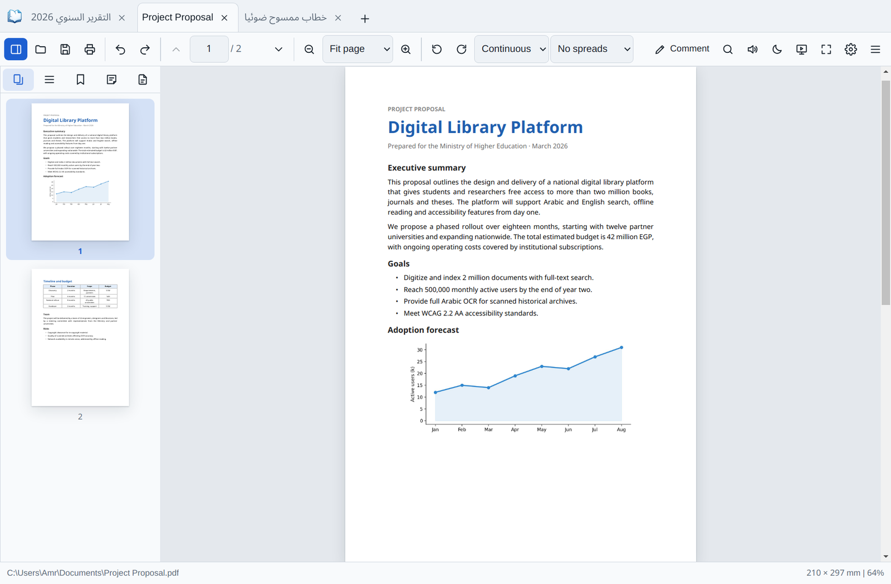
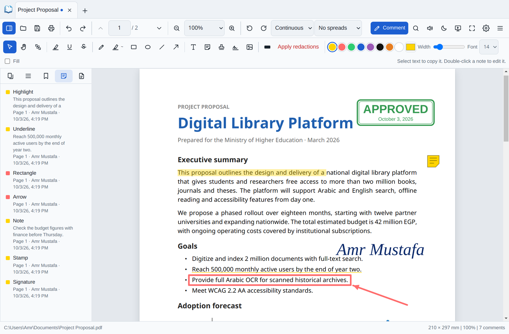
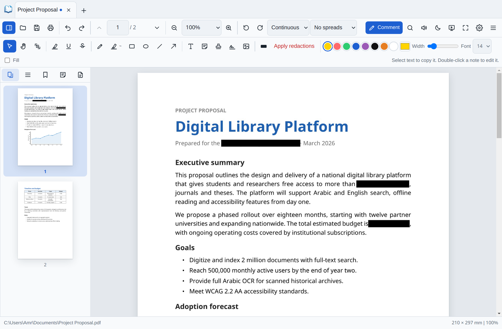
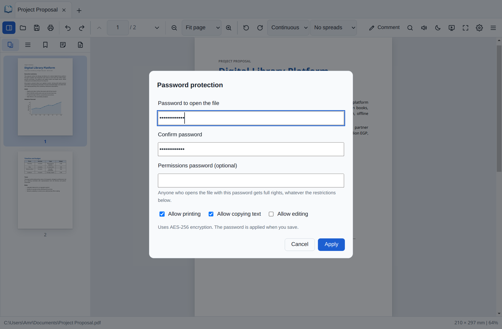
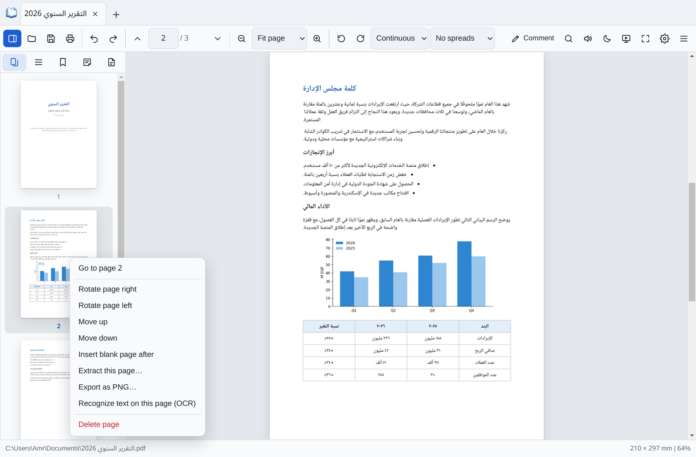
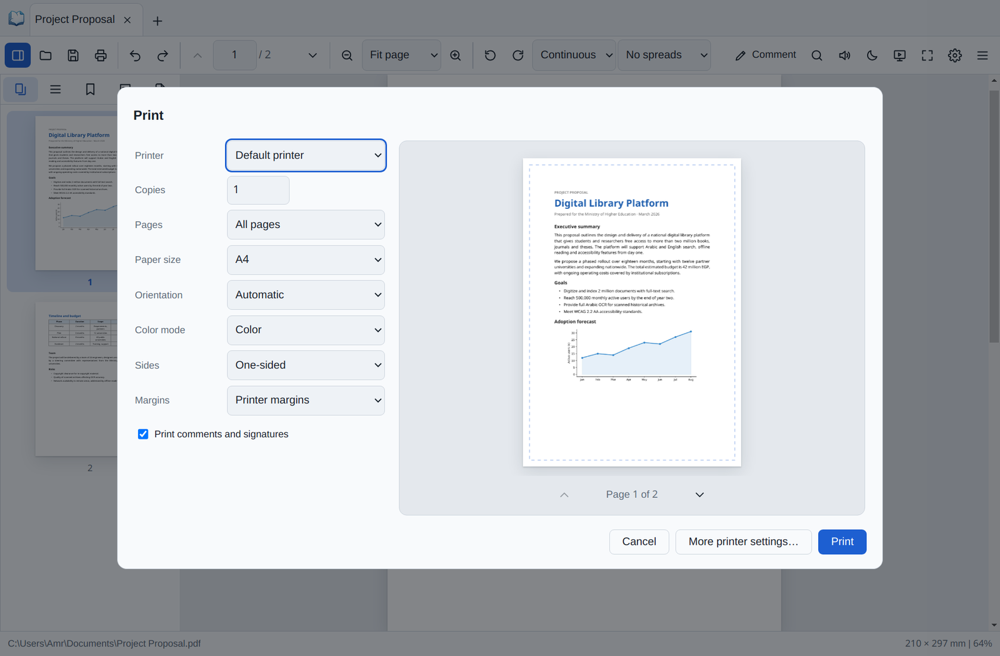
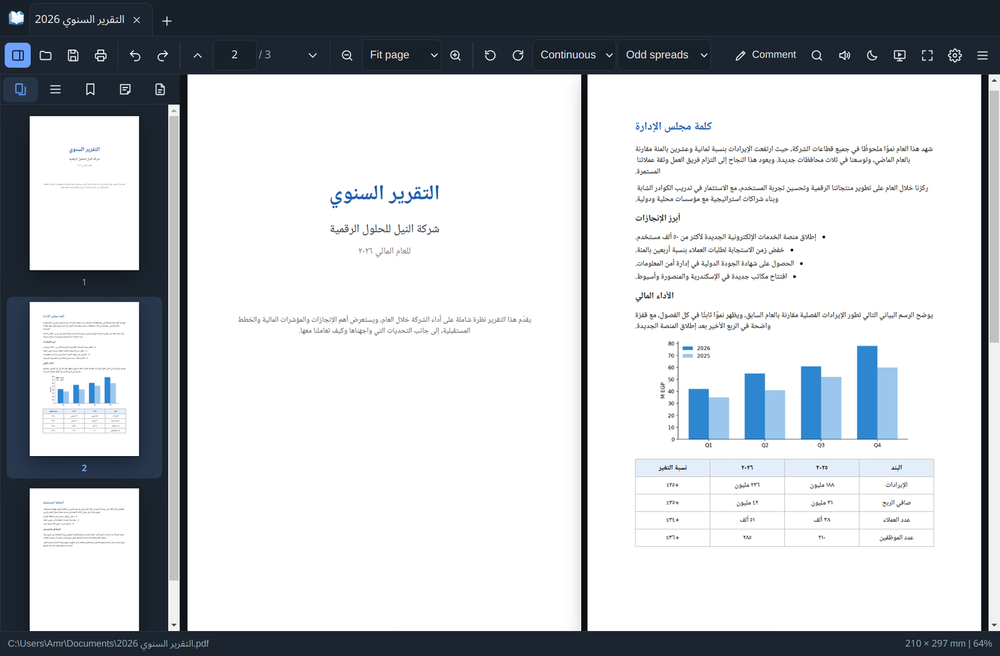
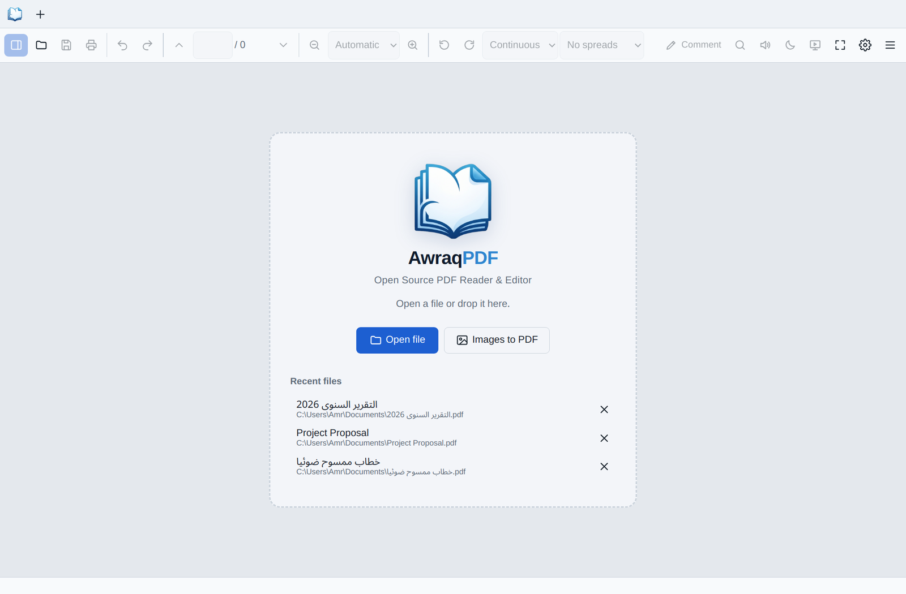

<p align="center"></p>

<h1 align="center">Awraq PDF</h1>
<h3 align="center" dir="rtl">أوراق PDF</h3>

<p align="center"><b>Open Source PDF Reader &amp; Editor for Windows</b></p>
<p align="center" dir="rtl">قارئ ومحرر PDF مجاني ومفتوح المصدر لويندوز</p>

<p align="center">
  <a href="https://github.com/SoCalledBlackBurn/Awraq-PDF/releases/latest"></a>
  <a href="LICENSE"></a>
  
</p>

<p align="center">English · Français · Español · Türkçe · <span dir="rtl">العربية</span></p>

## Screenshots

### Reading
Tabs like a browser, page thumbnails, outline and bookmarks, with several page layouts and zoom modes.



### Comments & signing
Highlights, underlines, shapes, sticky notes, stamps and signatures, saved as real PDF annotations that open in any reader.



### Arabic OCR
Scanned pages become searchable and copyable, fully offline. Shown here: searching an Arabic word in a scanned page.


### Redaction
Sensitive text is removed for good, not just covered. You can also search for a phrase and redact every match at once.



### Password protection
AES-256 encryption with control over printing, copying and editing.



### Page tools
Right-click a page to rotate, move, extract, export, recognize text, insert a blank page or delete it. Drag thumbnails to reorder.



### Print preview
Live preview with paper size, orientation, color, two-sided printing and margins.



### Dark mode
A dark theme for the interface, here with a two-page spread of an Arabic report.



### Start screen
Open or drop a PDF, turn images into a PDF, or pick up a recent file.



## Features

- **Reading:** tabs (drag to reorder, tear off into new windows), thumbnails, outline, bookmarks, attachments, continuous / single / horizontal / grid layouts, spreads, night mode, presentation mode, read aloud, advanced search.
- **Comments (real PDF annotations, editable after reopening):** highlight, underline, strike-out, pen, shapes, arrows, text boxes, sticky notes, stamps, signatures, images.
- **Security:** AES-256 password protection, permissions, true redaction (including "redact every match").
- **Tools:** OCR for scanned files (Arabic, English, French, Spanish, German, Turkish), reduce file size, merge, split, extract, reorder, rotate, delete and insert pages, images → PDF, export as PNG / TXT, fill forms.
- **Printing:** built-in print dialog with live preview, paper size, orientation, color, two-sided and margins.

<div dir="rtl">

## بالعربي

**أوراق PDF** برنامج مجاني ومفتوح المصدر لقراءة ملفات PDF وتعديلها على ويندوز، بواجهة عربية كاملة.
يدعم التعليقات والتظليل والتوقيع، والتعرف على النص العربي في الملفات الممسوحة ضوئيًا (OCR)، والحجب النهائي للمعلومات الحساسة، وحماية الملفات بكلمة مرور، وتقليل الحجم، ودمج الملفات وتقسيمها، والطباعة مع المعاينة.

**التحميل:** من صفحة [الإصدارات](https://github.com/SoCalledBlackBurn/Awraq-PDF/releases/latest).

</div>

## Download

Download the installer or the portable version from **[Releases](https://github.com/SoCalledBlackBurn/Awraq-PDF/releases/latest)**.
The installed version updates itself automatically.

> Windows may show "Windows protected your PC" because the app isn't code-signed yet. Click **More info → Run anyway**.

## Run from source

Requires [Node.js](https://nodejs.org/) 20+.

```bash
npm install
npm start          # run the app
npm run dist       # build installer + portable exe into dist/
```

## Publishing a release

1. Edit `version` in `package.json` (e.g. `2.3.2`) and commit.
2. Open the **Actions** tab → **Release** → **Run workflow**.
3. About 10 minutes later the installer and portable exe appear in **Releases**. Installed copies update themselves.

## Author

**Amr Mustafa M. M.** — [@SoCalledBlackBurn](https://github.com/SoCalledBlackBurn)

## License

Copyright © 2026 Amr Mustafa M. M.

Awraq PDF is free software: you can redistribute it and/or modify it under the terms of the
**GNU General Public License v3.0 or later**. See [LICENSE](LICENSE).

It is distributed WITHOUT ANY WARRANTY. Third-party components and their licenses are listed in [NOTICE.md](NOTICE.md).
